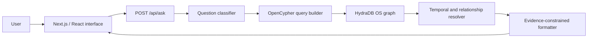

# Klazz — Institutional Memory for AI Executives

Klazz is a company-memory system that helps teams understand **what happened, what changed, and what is still true**.

It uses [HydraDB OS](https://github.com/hydra-db/hydradb) as its persistent graph-memory layer. Company facts are stored with timestamps, provenance, status, and relationships so Klazz can distinguish current truth from historical or superseded information. Every supported answer includes the records that produced it; when no reliable memory exists, Klazz abstains instead of guessing.

**Live demo:** [useklazz.vercel.app](https://useklazz.vercel.app)

## Contents

- [The problem](#the-problem)
- [What Klazz does](#what-klazz-does)
- [Why HydraDB](#why-hydradb)
- [Architecture](#architecture)
- [How an answer is produced](#how-an-answer-is-produced)
- [Demo questions](#demo-questions)
- [Data model](#data-model)
- [Run locally](#run-locally)
- [API](#api)
- [Testing and verification](#testing-and-verification)
- [Failure behavior](#failure-behavior)
- [Project structure](#project-structure)
- [Current limitations](#current-limitations)
- [License and attribution](#license-and-attribution)

## The problem

Company truth changes continuously:

- Launch dates move.
- Budgets are revised.
- Ownership changes.
- Hiring plans become constrained.
- New decisions replace old ones.

The old information usually remains in meeting notes, documents, chat history, and previous AI conversations. A conventional retrieval system may find a relevant memory without knowing whether it still applies. That creates a dangerous failure mode: a confident answer based on an outdated fact.

Klazz treats relevance and currency as separate questions. It retrieves the relevant company history, resolves the state that applies to the user’s question, and exposes the supporting evidence.

## What Klazz does

Klazz supports four core behaviors:

1. **Remember** — preserve company facts across sessions with their source and event time.
2. **Connect** — retrieve related decisions and constraints as a graph rather than isolated text fragments.
3. **Resolve** — distinguish current, historical, superseded, conflicting, and missing states.
4. **Abstain** — return a clear “no supported memory” response when the graph contains no reliable answer.

The MVP demonstrates these behaviors with a synthetic company called **Lumen Labs**. Its corpus contains 40 graph records representing 38 company sessions, including launch-date revisions, headcount changes, stable company facts, and a multi-step hiring constraint.

## Why HydraDB

HydraDB is not an optional datastore in Klazz; it performs the product’s essential memory work.

Klazz uses HydraDB to:

- Persist dated company facts and their provenance.
- Represent supersession and dependency relationships.
- Retrieve current and historical states with OpenCypher queries.
- Traverse connected context such as hiring → burn → runway → approval.
- Return query IDs, read epochs, and bookmarks for verification.
- Preserve graph state across service restarts.

The project runs the official open-source HydraDB image:

```dockerfile
FROM ghcr.io/hydra-db/hydradb@sha256:db78309a233be54662db29744047e985a39b51c45a270d1a1f47c31a62cdb709
```

Queries are sent to HydraDB’s authenticated HTTP endpoint with strong consistency:

```text
POST /v1/graphs/default/query
X-Graph-Namespace: default
Authorization: Bearer <token>
```

Without HydraDB, Klazz cannot retrieve evidence, resolve temporal state, traverse decision dependencies, or produce its primary answers.

## Architecture



### Application layers

| Layer | Responsibility |
| --- | --- |
| Landing page | Explains the problem, product, temporal model, and HydraDB integration. |
| Interactive workspace | Accepts questions and displays answers, paths, evidence, and recovery states. |
| `/api/ask` | Validates input, queries HydraDB, handles timeouts, and returns the result contract. |
| Question classifier | Maps supported question forms to current, historical, stable, connected, or unknown queries. |
| HydraDB OS | Stores facts, constraints, sessions, timestamps, statuses, and graph relationships. |
| Resolver | Selects the valid state, surfaces conflicts, or produces an abstention. |
| Formatter | Converts resolved HydraDB evidence into deterministic user-facing answers. |

The deployed application can query HydraDB directly with `HYDRADB_URL` and `HYDRADB_TOKEN`, or forward to an existing Klazz API through `KLAZZ_UPSTREAM_URL`. Neither mode falls back to mocked answers when company memory is unavailable.

## How an answer is produced

### Current-state question

For “When are we launching now?” Klazz:

1. Classifies the question as a current launch query.
2. Retrieves all matching launch facts from HydraDB.
3. Finds the single fact marked `active`.
4. Retains older facts as superseded evidence.
5. Returns **October 3, 2026** with the September 12 → October 3 path.

### Historical question

For “What was our launch date in June?” Klazz:

1. Retrieves the same launch history.
2. Applies a June 30, 2026 cutoff.
3. Selects the latest fact that existed at that time.
4. Returns **September 12, 2026**, while explaining that the record was later superseded.

### Connected-context question

For “Why can’t we hire another engineer before launch?” Klazz runs three relationship queries and combines this path:

```text
Engineering hire
  DEPENDS_ON → monthly burn above $92,000
  REDUCES    → runway below nine months
  REQUIRES   → board approval
```

The answer is produced only when all required HydraDB relationship queries return evidence.

### Unknown question

For “Who is our lawyer?” HydraDB returns no matching fact. Klazz stops and responds:

> I don’t have a recorded company memory that answers that yet.

No fallback model or fabricated answer is used.

## Demo questions

Open the [live workspace](https://useklazz.vercel.app/app) and try:

| Question | Demonstrates | Expected result |
| --- | --- | --- |
| When are we launching now? | Current-state resolution | October 3, 2026 |
| What was our launch date in June? | Historical resolution | September 12, 2026 |
| What is our current headcount? | Current mutable fact | 10 employees |
| What was our headcount in June? | Historical mutable fact | 8 employees |
| Are we launching a web or mobile product? | Stable fact retrieval | Web application |
| Why must hiring wait until launch? | Connected constraint reasoning | Protect the nine-month runway |
| Under what condition could we approve another engineering hire? | Decision-gate retrieval | Only with board approval |
| How are burn rate, runway, and hiring connected? | Multi-hop graph context | Burn → runway → hiring restriction |
| Who is our lawyer? | Safe abstention | No supported company memory |

Each supported result includes its source session, event time, stored status, HydraDB query ID, and read epoch.

## Data model

Klazz uses three primary graph labels:

| Label | Purpose | Important properties |
| --- | --- | --- |
| `Session` | Source event or company update | `session_id`, `event_time`, `app_id` |
| `Fact` | A stored company state | `fact_key`, `fact_value`, `status`, `session_id`, `event_time` |
| `Constraint` | A rule or decision gate | `fact_key`, `fact_value`, `session_id`, `event_time` |

Important relationships include:

- `ASSERTS` — connects a session to the fact it introduced.
- `SUPERSEDES` — connects a newer fact to the older state it replaced.
- `DEPENDS_ON` — connects a decision or constraint to a prerequisite.
- `REDUCES` — models a negative operational effect.
- `REQUIRES` — connects a condition to an approval or decision gate.

All demo records are scoped with `app_id: 'klazz-demo'`, allowing seed resets to remove only Klazz-owned data.

## Run locally

### Prerequisites

- Node.js 22.13 or newer for the web application.
- Docker for HydraDB OS.
- Git.

### 1. Clone the repository

```bash
git clone https://github.com/OutstandingVick/klazz.git
cd klazz
```

### 2. Build and start HydraDB

```bash
docker build -t klazz-hydradb ./deploy/hydradb

docker run -d \
  --name klazz-hydradb \
  -p 18443:8443 \
  -p 17687:7687 \
  -p 19090:9090 \
  -e HYDRADB_TOKEN=local-development-token-32-bytes \
  -v klazz-hydradb-data:/data/store \
  klazz-hydradb
```

### 3. Configure the application

```bash
cd app
cp .env.example .env.local
npm install
```

Default local configuration:

```dotenv
HYDRADB_URL=http://127.0.0.1:18443
HYDRADB_TOKEN=local-development-token-32-bytes
```

Optional proxy mode:

```dotenv
KLAZZ_UPSTREAM_URL=https://your-existing-klazz-api.example
```

When `KLAZZ_UPSTREAM_URL` is configured, the API forwards normalized questions to that Klazz backend. Otherwise, it queries HydraDB directly.

### 4. Seed the company-memory graph

```bash
npm run seed:reset
```

The seed waits for HydraDB’s query engine, removes only existing `klazz-demo` nodes, recreates the canonical corpus, and verifies the launch supersession and hiring dependency paths.

### 5. Start Klazz

```bash
npm run dev
```

Open the local URL printed by the development server.

## API

### `POST /api/ask`

Request:

```json
{
  "question": "When are we launching now?"
}
```

Successful response shape:

```json
{
  "state": "answer",
  "answer": "October 3, 2026",
  "temporalStatus": "current",
  "explanation": "September 12, 2026 was explicitly superseded by October 3, 2026.",
  "evidence": [
    {
      "sessionId": "session-2026-06-03-launch",
      "eventTime": "2026-06-03T10:00:00Z",
      "value": "September 12, 2026",
      "status": "superseded"
    },
    {
      "sessionId": "session-2026-07-18-launch",
      "eventTime": "2026-07-18T15:00:00Z",
      "value": "October 3, 2026",
      "status": "active"
    }
  ],
  "path": ["September 12, 2026", "SUPERSEDES", "October 3, 2026"],
  "verification": {
    "database": "HydraDB OS · graph default",
    "queryId": "<HydraDB query ID>",
    "readEpoch": 34,
    "bookmark": "<HydraDB bookmark>"
  }
}
```

Possible `state` values:

- `answer` — a supported state was resolved.
- `abstain` — no matching company memory was found.
- `conflict` — multiple facts are active and Klazz will not choose arbitrarily.

Invalid questions shorter than 3 or longer than 500 characters return HTTP `400`. HydraDB timeouts or outages return HTTP `503` with a retryable error and no fallback answer.

## Testing and verification

From the `app/` directory:

```bash
# Unit, seed, journey, landing, and responsive tests
npm test

# Lint and production builds
npm run lint
npm run build
npm run vercel-build
```

Run the complete HTTP journey against a running application:

```bash
KLAZZ_TEST_URL=http://localhost:3000 npm test
```

Run the 40-question evaluation suite:

```bash
KLAZZ_TEST_URL=http://localhost:3000 npm run evaluate
```

The evaluation covers stable facts, current state, historical state, multi-session relationships, and abstention. Abstention cases are mandatory: the evaluation fails if Klazz invents an answer for any unsupported question.

### Independent evidence verification

Compare the application response with direct strong-consistency HydraDB queries:

```bash
KLAZZ_TEST_URL=http://localhost:3000 \
HYDRADB_URL=http://127.0.0.1:18443 \
HYDRADB_TOKEN=local-development-token-32-bytes \
npm run verify -- "When are we launching now?"
```

The command emits a JSON receipt containing:

- The application answer and evidence.
- Application-side HydraDB query IDs and read epoch.
- Direct HydraDB rows and query IDs.
- An `evidence_matches` result.

HydraDB OS exposes query IDs but does not currently provide a public explorer URL for them.

### Open-source HydraDB feasibility proof

The repository root retains the original sponsor-runtime proof:

```bash
npm test
npm run os-spike
```

The proof writes dated facts and a real `SUPERSEDES` edge, performs current and historical reads, tests an absent fact and malformed query, restarts HydraDB against the same durable store, and verifies that the graph remains available.

## Failure behavior

Klazz is deliberately fail-closed:

- Missing or invalid input produces a clear validation error.
- A slow HydraDB request is cancelled after eight seconds.
- A HydraDB outage returns a retryable `503` response.
- No cached, mocked, or generated answer replaces unavailable evidence.
- Multiple active facts produce a conflict state instead of an arbitrary answer.
- The interface exposes a retry action and remains usable after recovery.

The automated outage test pauses the HydraDB container, confirms the `503` state, restarts the database, and verifies that the original answer is recovered with a new query ID.

## Project structure

```text
klazz/
├── app/
│   ├── app/
│   │   ├── api/ask/route.ts       # HydraDB-backed question API
│   │   ├── KlazzClient.tsx        # Interactive workspace
│   │   └── page.tsx               # Landing page composition
│   ├── components/landing/        # Seven landing-page sections
│   ├── lib/klazz.ts               # Classification, queries, resolution, formatting
│   ├── scripts/
│   │   ├── seed-hydra.mjs         # Canonical HydraDB corpus
│   │   ├── evaluate.mjs           # 40-question evaluation
│   │   ├── test-outage.mjs        # Failure and recovery test
│   │   └── verify-result.mjs      # Independent evidence verification
│   └── tests/                      # Unit, journey, seed, UI, and responsive tests
├── deploy/hydradb/
│   ├── Dockerfile                 # Pinned official HydraDB OS image
│   └── entrypoint.sh              # Storage and bearer-token setup
├── evidence/                      # Raw sponsor-runtime proof output
├── os-spike.mjs                   # HydraDB durability feasibility proof
├── PRD_AMENDMENTS.md              # Accepted MVP architecture decisions
├── PROJECT_STATUS.md              # Engineering completion record
└── SPIKE_REPORT.md                # HydraDB feasibility report
```

## Current limitations

- The MVP uses a synthetic Lumen Labs corpus rather than ingesting a real company workspace.
- Question classification and answer wording are deterministic and optimized for the demonstrated fact families.
- The hackathon MVP does not call an LLM. This is intentional: every answer is formatted only from resolved HydraDB evidence.
- HydraDB OS query IDs are exposed for verification, but there is no public explorer link.
- Authentication, tenant isolation, ingestion connectors, and administrative memory editing are outside the current MVP.

These constraints keep the core claim independently testable: data moves through a real HydraDB graph, the resolver selects a valid state, and the user can inspect the records behind the result.

## Technology stack

- TypeScript
- Next.js 16
- React 19
- Tailwind CSS and responsive CSS
- HydraDB OS and its authenticated OpenCypher HTTP API
- Node.js test runner and ESLint
- Vercel
- Docker and Railway-compatible HydraDB deployment

## License and attribution

Klazz-authored source code is released under the [MIT License](LICENSE).

Third-party software remains subject to its upstream license:

- [HydraDB OS](https://github.com/hydra-db/hydradb) — graph persistence, relationship traversal, and strong-consistency retrieval; GNU AGPLv3.
- [Next.js](https://github.com/vercel/next.js) and [React](https://github.com/facebook/react) — application framework and UI runtime.
- [vinext](https://github.com/cloudflare/vinext) — Cloudflare-compatible application build runtime; MIT.
- [Tailwind CSS](https://github.com/tailwindlabs/tailwindcss) — styling toolchain.

The Lumen Labs company-memory corpus is synthetic and was created for this project. No private company data or third-party dataset is included.
